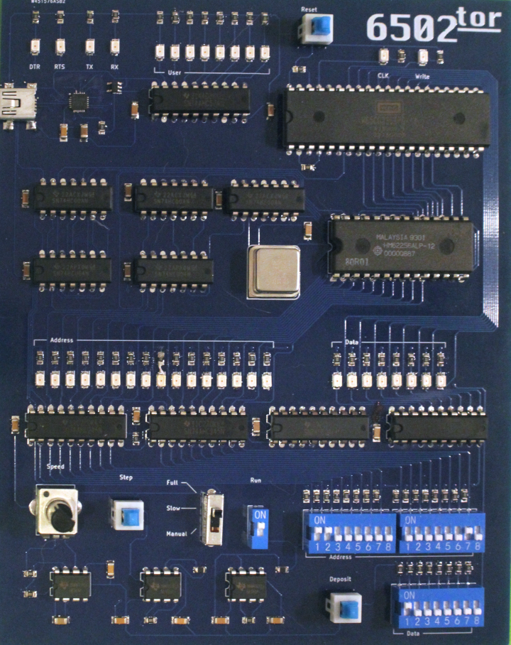
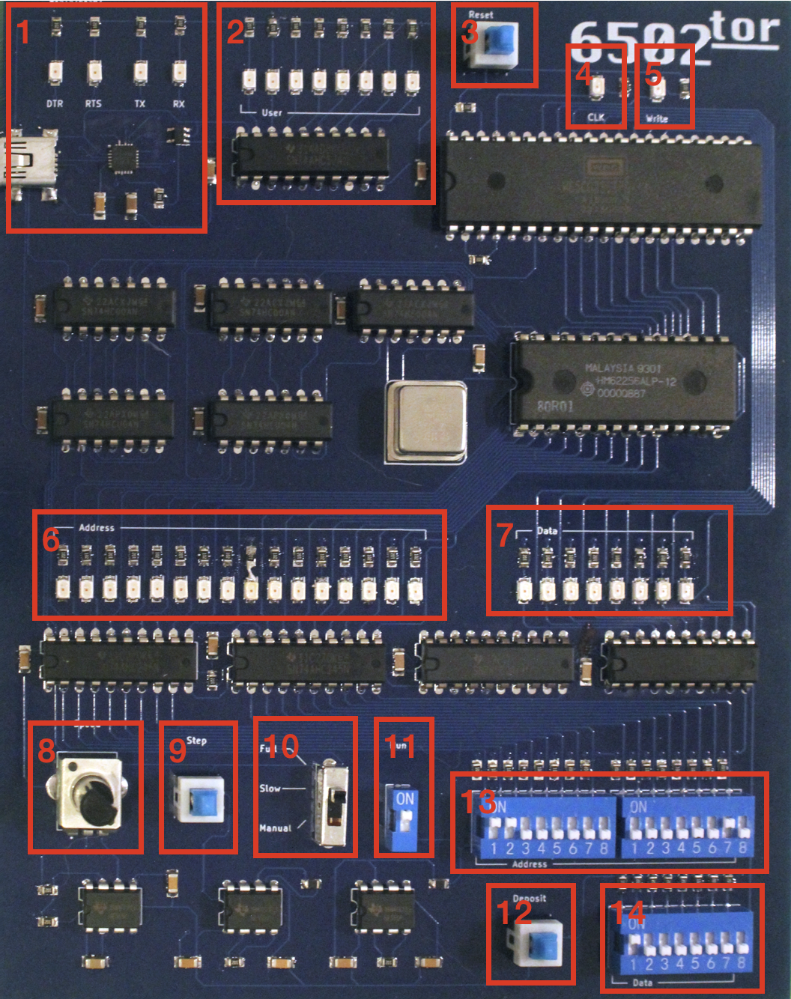

# 6502tor

This is the project page for the 6502tor project, a minimal educational computer designed to teach the fundamentals of how a computer actually operates near the lowest levels.

If you received an assembled rev1 board as a holiday gift, it probably looks something like this:

If you're interested in details about how the actual board is designed and built, you should check out the [hardware](hardware/README.md) section.

## Using The Hardware

This computer system is simultaneously incredibly simple while, by the token of complete open-endedness this implies, very complicated. With only a handful of controls, you can get the 6502tor to perform any function that can be done by *any other* computer.

For that reason, most of the system operation is going to be provided by a series of tutorial articles that will be published over time and which can be found below:

### Articles:
 - [0000 0001 - Basic controls](articles/0000_0001_basic_controls/article.md)

### System Overview:

For the purpose of providing a quick reference so that you don't have to read through the articles if you need a reminder, the below chart provides a description of all the basic controls on the board:

1. **USB Port** - Provides power to the system and also, in more advanced uses, serial communication with a host machine

2. **User Register** - Provides 8 bits of output and can be written to at any address between `0x4000` and `0xBFFF`. The top two bits are also attached to the USB chip for more advanced serial I/O purposes:
   - Bit 6: RXD
   - Bit 7: CTS

3. **CPU Reset** - A toggle switch that causes the CPU to do an internal reset when pressed in and allows the CPU to begin executing from the reset vector stored in RAM at `0xFFFC` when released. 
Should be pressed in for at least 3 clock cycles whenever the clock source is changed or in any other scenario where you want the CPU to begin running from its default state.

4. **CLK LED** - Displays the clock signal being fed into the CPU.

5. **Write LED** - Displays whether the system is currently reading or writing data from/to the bus. Probably backwards from what you expect, *there is a write occurring when this LED is **OFF***

6. **Address LEDs** - Display the address that is currently being driven on the address bus, whether that's by the CPU or by the `address switches` (depending on the run/program mode)

7. **Data LEDs** - Display the data that is currently being driven on the data bus, whether that's by the CPU or by the `data switches` (depending on the run/program mode). Note that in run mode, the data bus is only driven during the *high* portion of the clock cycle.

8. **Slow Clock Speed Control** - When the clock source switch is set to 'slow', controls the speed of the slow CPU clock (clockwise is faster).

9. **Step Button** - When the clock source switch is set to 'manual', directly controls the CPU clock. When pressed in, sets the `CLK` signal to low and when not pressed in sets the `CLK` signal to high.
It should be noted that data only appears on the data bus during the high portion of the clock cycle.

10. **Clock Source Switch** - Switches the CPU between three different clock sources/speed ranges:

     - **Full** - Connects the CPU directly to the 5 megahertz crystal oscillator (the metal can in the middle of the board)

     - **Slow** - Connects the CPU to a much slower RC oscillator that can run the CPU between ~0.5 hertz and a few kilohertz depending on how the `Slow Clock Speed Control` is set

     - **Manual** - Connects the clock directly to a debounced pushbutton so that you can manually step through clock cycles as slowly as you would like

11. **Run/Program Switch** - Switches the board between `run` mode, in which the CPU is controlling everything, and the `program` mode in which the CPU is disconnected from the bus and the data switches, address switches, and deposit button can be used to manually place instructions and data into RAM.

12. **Deposit Button** - When the run/program switch is in program mode, depressing this button causes the value set on the data switches to be written to the location specified by the address switches. *This is a toggle button, so make sure to press it twice for each deposit*.

13. **Address Switches** - When the run/program switch is in program mode, the value of these switches is displayed on the address LEDs and the value stored at that location is displayed on the data LEDs. If the deposit switch is pressed, the value on the data switches is written to the address set on these switches.

14. **Data Switches** - When the run/program switch is in program mode, the value on these switches is written to the location set on the address switches. When the run/program switch is in the run mode, the value of the lowest five data switches can be read at addresses from `0x4000` to `0x8FFF`. In this mode, the top three bits connect to the USB chip as follows:

    - Bit 5: TXD
    - Bit 6: RTS
    - Bit 7: DTR 

### Memory Map:
| **Start** | **End** | **Description**                          |
|-----------|---------|------------------------------------------|
| 0x0000    | 0x3FFF  | 32K of RAM                               |
| 0x4000    | 0xBFFF  | Read data switches / Write user register |
| 0xC000    | 0xFFFF  | 32K of RAM                               |

## Reference Material And Resources
 - [6502 CPU datasheet](https://www.westerndesigncenter.com/wdc/documentation/w65c02s.pdf)
 - [6502 CPU instruction reference](https://www.masswerk.at/6502/6502_instruction_set.html)
 - [Online 6502 assembler](https://www.masswerk.at/6502/assembler.html) (for simple manual programming)
 - [cc65 compiler/cc65 assembler](https://github.com/cc65/cc65) (for more involved programming)
 - [RS232 serial communications on wikipedia](https://en.wikipedia.org/wiki/RS-232#Physical_interface)

